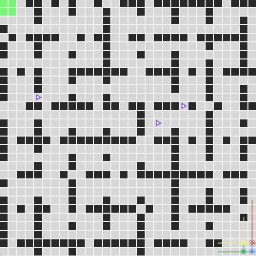
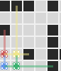
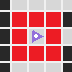

# Hackathon : Apprentissage par renforcement pour la navigation de drones

_Votre tâche est de développer un algorithme d'apprentissage par renforcement (RL) pour enseigner aux drones à naviguer de manière autonome dans un environnement en grille, atteignant leur objectif le plus rapidement possible tout en évitant les obstacles. L'environnement inclut des murs et des obstacles dynamiques que les drones doivent contourner pour réussir leur mission._



## 🌍 Présentation du projet

Cet ensemble d'outils fournit un environnement simulé dans lequel vos drones doivent naviguer. L'objectif est que vos drones prennent des actions optimales pour atteindre leur cible rapidement tout en évitant les collisions avec des obstacles dynamiques. L'environnement comprend des murs et des obstacles mobiles qui peuvent changer de position à chaque étape.

Ce guide vous accompagnera dans les premières étapes pour utiliser les outils fournis afin de construire et d'entraîner votre agent. L'ensemble d'outils inclut les fichiers suivants :

- `requirements.txt` - liste des bibliothèques et dépendances nécessaires pour exécuter le projet ;
- `teamname_hackathon.ipynb` - notebook pour entraîner et tester votre agent ;
- `simulate.py` - exécute des épisodes de simulation pour l'entraînement ou le test ;
- `env.py` - contient la configuration et la mise en place de l'environnement ;
- `agent.py` - contient la logique de la politique et de la sélection d'actions de l'agent ;
- `reward.py` - contient la fonction de calcul des récompenses ;
- `config.json` - fichier de configuration pour modifier les paramètres de l'environnement et des drones.

## 📚 Prérequis

Avant de commencer, assurez-vous d'avoir installé les dépendances nécessaires en exécutant :

```bash
pip install -r requirements.txt
```

## ⚡ Guide rapide

Le fichier `teamname_hackathon.ipynb` est divisé en deux sections principales :

- _1. Entraînement_ : la première cellule vous permettra d'exécuter rapidement des simulations d'entraînement dans l'environnement en utilisant les paramètres définis dans `config.json`. Dans l'implémentation actuelle, **les actions des agents sont sélectionnées de manière aléatoire**, ce qui vous donne un modèle de référence (aucun apprentissage n'est appliqué).
- _2. Évaluation_ : cette section vous permet de tester un

agent entraîné avec des configurations fixes et d'enregistrer les résultats dans un fichier `csv`.

Vous pouvez interrompre la simulation à tout moment en utilisant `Ctrl+C`.

## 🤖 Agents

Les drones représentent les agents dans l'environnement. À chaque étape, chaque agent doit choisir l'une des actions suivantes :

- rester immobile ;
- avancer ;
- reculer ;
- se déplacer à gauche ;
- se déplacer à droite ;
- tourner à droite ;
- tourner à gauche.

Chaque agent est équipé d'un système LIDAR (faisceaux translucides) qui analyse son environnement dans un rayon défini :

- le LIDAR principal scanne devant l'agent avec une portée plus longue définie par `max_lidar_dist_main` dans `config.json` ;
- les LIDAR secondaires scannent à gauche et à droite avec une portée plus courte définie par `max_lidar_dist_second` dans `config.json`.



L'agent reçoit l'état suivant à chaque étape :

- sa position et orientation actuelles (x, y, o) ;
- son statut (0 : actif, 1 : évacué, 2 : désactivé) ;
- la position de son objectif (x, y) ;
- les données LIDAR dans les 3 directions (principal, droite, gauche) :
  - la distance jusqu'à l'obstacle le plus proche (ou la portée maximale si aucun obstacle n'est présent) ;
  - le type d'obstacle détecté (0 : aucun, 1 : mur ou bordure de la grille, 2 : obstacle dynamique, 3 : autre agent).
- pour chaque agent dans la portée de communication :
  - leur position et orientation ;
  - leur statut ;
  - leurs données LIDAR.

Ces informations peuvent être utilisées telles quelles pour la sélection d'actions, mais vous pouvez également les transformer ou les combiner, à condition de ne pas ajouter d'informations externes.

Votre objectif est de construire votre propre agent en modifiant la classe `MyAgent()` dans le fichier `agent.py`. Nous vous recommandons d'implémenter les méthodes nécessaires pour sélectionner une action, comme `get_action()`, et pour mettre à jour la politique avec `update_policy()`.

Pour des itérations plus rapides ou plus lentes, vous pouvez ajuster la fonction `time.sleep()` entre chaque itération dans `simulate.py`. Pour entraîner sans affichage, ce qui peut ralentir les itérations, utilisez `render_mode=None` dans `config.json`.

## 🏙️ Environnement

L'environnement est défini dans `env.py` et est généré semi-aléatoirement à l'aide d'une graine. Il n'y a pas de restrictions sur les environnements utilisés pendant la phase d'entraînement.

### **Position de départ et objectif**

Les drones commencent dans l'un des quatre coins de la grille. L'objectif est toujours situé dans le coin opposé, marqué par une zone verte. Les drones doivent naviguer vers cet objectif.


### **Obstacles**

**Les murs** sont générés aléatoirement sous forme de carrés noirs. Les collisions désactivent les drones.

**Les obstacles dynamiques** sont générés aléatoirement sous forme de triangles violets, toujours situés en dehors des zones de départ et d'objectif. Ils peuvent se déplacer ou rester immobiles à chaque étape. Si un agent se rapproche d'une cellule adjacente à un obstacle dynamique, il est désactivé.



## ⚙️ Configuration

Pour entraîner vos agents et optimiser leur apprentissage, vous pouvez modifier les paramètres de configuration dans le fichier `config.json`. Les paramètres disponibles incluent :

- `grid_size` : taille de la grille ;
- `walls_proportion` : proportion de murs dans la grille ;
- `num_dynamic_obstacles` : nombre d'obstacles dynamiques ;
- `num_agents` : nombre de drones ;
- `communication_range` : portée maximale de communication entre drones ;
- `max_lidar_dist_main` : portée maximale du LIDAR principal ;
- `max_lidar_dist_second` : portée maximale des LIDAR secondaires ;
- `max_episodes` : nombre maximal d'épisodes avant réinitialisation ;
- `max_episodes_steps` : nombre maximal d'étapes par épisode ;
- `render_mode` (optionnel) : mode d'affichage pour Pygame (`"human"`) ; si `None`, aucun affichage ;
- `seed` (optionnel) : graine pour un environnement fixe.

Consultez la section _Évaluation_ pour plus de détails sur les configurations d'évaluation.

## 🎁 Récompense

La fonction de récompense, située dans `reward.py`, fournit un retour aux agents en fonction de leurs actions. L'implémentation actuelle est basique mais peut être modifiée pour améliorer l'apprentissage. Voici comment elle fonctionne :

- un agent désactivé (collision) reçoit une pénalité de -100 ;
- un agent atteignant l'objectif reçoit une récompense de +1000 ;
- pour tous les autres agents, une pénalité de -0,1 par étape est appliquée.

Vous êtes encouragés à modifier cette fonction pour créer un système de récompense plus optimal afin d'améliorer les performances d'apprentissage de vos agents.

## ✒️ Évaluation

Le 7ᵉ jour du hackathon à 00h01, nous fournirons un dossier contenant 10 configurations d'évaluation, telles que `"eval_configs/config_1.json"`. Vous devrez exécuter la section _2. Évaluation_ du notebook `teamname_hackathon.ipynb` pour tester les performances de vos agents sur ces configurations.

Renommez le notebook avec le nom de votre équipe et mettez à jour la première cellule avec les noms des membres de votre équipe.

### Livrables

Avant la fin du 7ᵉ jour (23h59), soumettez les fichiers suivants dans une archive `.zip` à contact.hackathon-ai.ah@airbus.com :

- `teamname_hackathon.ipynb` exécuté avec les sorties et les points de contrôle ;
- `agent.py` avec les fonctions d'action et de politique mises à jour ;
- `reward.py` avec la fonction de récompense modifiée ;
- `simulate.py` si des modifications ont été apportées ;
- `reward_curve_per_episode.png` généré automatiquement ;
- `all_results.csv` généré par *Évaluation* ;
- `averages.csv` ;
- `README.md` documentant votre code, vos modifications et votre processus d'entraînement ;
- Une vidéo de 2 minutes présentant votre équipe et montrant votre solution à un public non expert.

Si la taille des fichiers est trop grande, utilisez un lien WeTransfer.

### Critères d'évaluation

Vos performances seront évaluées comme suit :

- **75 %** Performance sur 10 environnements de test ;
- **5 %** Fonction de récompense ;
- **20 %** Courbe d'apprentissage et stratégie.

## 🏁 Bonne chance !

Soyez créatifs, expérimentez différentes approches, et amusez-vous !

N'hésitez pas à nous contacter en cas de questions à contact.hackathon-ai.ah@airbus.com

Bon codage ! 🤖
